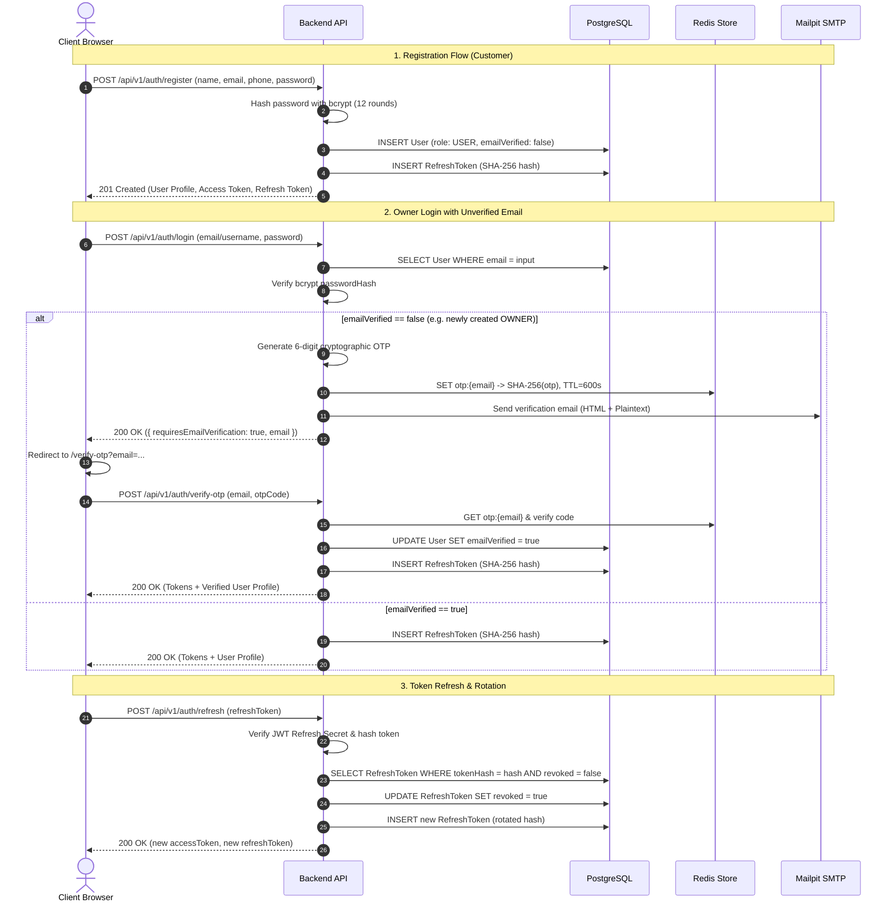

# Authentication & Role-Based Authorization

## 1. Roles & Permissions Matrix

ToyxonaHub implements strict Role-Based Access Control (RBAC) across four user levels:

- **GUEST**: Unauthenticated visitor.
- **USER**: Registered customer planning a wedding.
- **OWNER**: Venue manager managing wedding halls and ceremony services.
- **ADMIN**: Platform moderator and governance administrator.

| Capability / Resource | GUEST | USER | OWNER | ADMIN | Enforcement Mechanism |
| :--- | :---: | :---: | :---: | :---: | :--- |
| **Browse Approved Halls** | Yes | Yes | Yes | Yes | Public API (`GET /wedding-halls`) |
| **View Availability Calendar** | Yes | Yes | Yes | Yes | Public API (`GET /:id/availability`) |
| **Configure Booking Draft** | Yes | Yes | Yes | Yes | Client-side SessionStorage |
| **Create Booking** | No | **Yes** | No | No | `authorize(ROLES.USER)` |
| **View Own Bookings** | No | **Yes** | No | No | `authorize(ROLES.USER)` (`GET /bookings/my`) |
| **Pay 20% Advance** | No | **Yes** | No | No | Service ownership check (`POST /bookings/:id/pay`) |
| **Cancel Own Booking** | No | **Yes** | No | No | Service ownership check (`PATCH /bookings/:id/cancel`) |
| **Create Wedding Hall** | No | No | **Yes** | **Yes** | `authorize(ROLES.OWNER, ROLES.ADMIN)` |
| **Update Own Hall** | No | No | **Yes** | **Yes** | Hall ownership check (`PATCH /wedding-halls/:id`) |
| **Upload Hall Photos** | No | No | **Yes** | **Yes** | Hall ownership check (`POST /:id/images`) |
| **Manage Hall Services** | No | No | **Yes** | **Yes** | Hall ownership check (`/wedding-halls/:id/services/*`) |
| **View Hall Bookings** | No | No | **Yes** | No | Hall ownership check (`GET /bookings/owner`) |
| **Cancel Hall Booking** | No | No | **Yes** | **Yes** | Hall ownership check (`PATCH /bookings/:id/cancel`) |
| **Approve / Reject Hall** | No | No | No | **Yes** | `authorize(ROLES.ADMIN)` (`PATCH /:id/status`) |
| **Create Venue Owner** | No | No | No | **Yes** | `authorize(ROLES.ADMIN)` (`POST /owners`) |
| **Assign Hall to Owner** | No | No | No | **Yes** | `authorize(ROLES.ADMIN)` (`PATCH /:id/assign-owner`) |
| **Platform Booking Audit** | No | No | No | **Yes** | `authorize(ROLES.ADMIN)` (`GET /bookings/admin`) |
| **Delete Wedding Hall** | No | No | No | **Yes** | `authorize(ROLES.ADMIN)` (`DELETE /wedding-halls/:id`) |

---

## 2. Authentication Flow & Lifecycle



---

## 3. Token Architecture

### Access Tokens
- **Format**: JSON Web Token (JWT).
- **Signing Algorithm**: HMAC-SHA256 (`HS256`).
- **Signature Secret**: `JWT_ACCESS_SECRET`.
- **Expiration**: 15 minutes (`JWT_ACCESS_EXPIRES_IN=15m`).
- **Payload Claims**:
  ```json
  {
    "id": "uuid-user-id",
    "email": "user@example.com",
    "role": "USER",
    "iat": 1773400000,
    "exp": 1773400900
  }
  ```

### Refresh Tokens & Rotation
- **Format**: JWT with separate signature secret `JWT_REFRESH_SECRET`.
- **Expiration**: 7 days (`JWT_REFRESH_EXPIRES_IN=7d`).
- **Security Storage**: Refresh tokens are stored in PostgreSQL (`RefreshToken` table) **only as SHA-256 cryptographic hashes**. The plaintext token is never persisted in the database.
- **Strict Single-Use Rotation**: When `/api/v1/auth/refresh` is called, the provided refresh token is immediately marked `revoked: true`, and an entirely new refresh token pair is issued.

---

## 4. Email OTP Verification

- **Format**: 6-digit numeric string (e.g. `482910`).
- **Storage**: Redis key `otp:{email}` containing `{ codeHash: sha256(code), attempts: 0 }`.
- **Time-to-Live (TTL)**: 10 minutes (`600s`).
- **Brute Force Lockout**: Maximum 5 attempts (`OTP_MAX_ATTEMPTS=5`). Once exceeded, the key is evicted, requiring a new code request.
- **Delivery**: Dispatched via Nodemailer over SMTP to Mailpit in development.

---

## 5. Client Route Protection

Frontend routing enforces authentication boundaries using two components:

1. `ProtectedRoute.jsx` (`src/routes/ProtectedRoute.jsx`):
   - Inspects `AuthContext.isAuthenticated`.
   - If not authenticated, captures `location.pathname` and navigates to `/login`, enabling transparent return redirection after login.
2. `RoleRoute.jsx` (`src/routes/RoleRoute.jsx`):
   - Compares `user.role` against `allowedRoles`.
   - If user does not possess the requisite role, gracefully redirects to `/` with an unauthorized warning.
