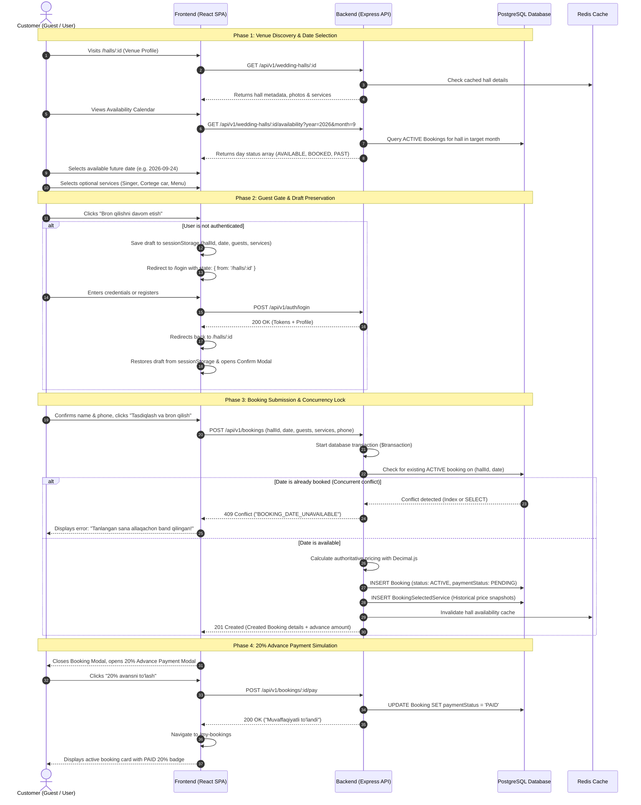

# End-to-End Booking Lifecycle

## 1. Overview

The ToyxonaHub booking lifecycle is designed to minimize customer friction by allowing guests to freely discover venues, inspect availability, and customize services without requiring an account upfront. Authentication is requested only at the final confirmation step, with zero loss of customer selections.

---

## 2. Booking Journey Sequence Diagram



---

## 3. Server-Authoritative Price Calculation

While the frontend computes a live preview estimate during service selection to provide instant feedback, the **backend is strictly authoritative** for all finalized transaction amounts.

When `POST /api/v1/bookings` is received, the calculation engine (`calculateBookingPrices`) executes the following operations using `Decimal.js`:

$$
\text{hallPrice} = \text{pricePerSeat} \times \text{guestCount}
$$

$$
\text{servicesPrice} = \sum \text{Verified Prices from DB for Singer, Car, Menu, Karnay}
$$

$$
\text{totalPrice} = \text{hallPrice} + \text{servicesPrice}
$$

$$
\text{advanceAmount} = \text{totalPrice} \times 0.20 \quad (\text{rounded to } 2 \text{ decimals})
$$

### Immutable Historical Snapshots
To prevent past customer bookings from fluctuating if venue owners subsequently change service fees, every selected service is recorded in `BookingSelectedService` with an immutable price snapshot:
- `nameSnapshot`: Exact service name at time of booking (e.g. *"Botir Qodirov"*).
- `priceSnapshot`: Exact fee applied at time of booking (e.g. `11000000.00`).

---

## 4. Concurrency & Double-Booking Protection

ToyxonaHub guarantees that two customers cannot reserve the same wedding hall on the same date:

1. **Transaction Pre-Check**: The backend service queries for any existing `ACTIVE` reservation on `(weddingHallId, bookingDate)` inside an interactive transaction.
2. **PostgreSQL Partial Unique Index**:
   ```sql
   CREATE UNIQUE INDEX unique_active_booking_per_hall_date
   ON "Booking" ("weddingHallId", "bookingDate")
   WHERE status = 'ACTIVE';
   ```
3. If two concurrent requests pass application checks simultaneously, the PostgreSQL storage engine forces one transaction to succeed and throws unique constraint error `P2002` on the other.
4. The error handler maps `P2002` on `bookingDate` directly to HTTP `409 Conflict` with code `BOOKING_DATE_UNAVAILABLE`.
5. The frontend invalidates query cache `['hall-availability', id]`, automatically re-rendering the date as occupied (`BOOKED`) on the calendar.

---

## 5. Simulated 20% Advance Payment

> [!NOTE]
> ToyxonaHub uses a **simulated mock payment workflow** to fulfill academic and demonstration contract requirements. No third-party payment gateways (e.g. Payme, Click, Stripe) are integrated.

- **Endpoint**: `POST /api/v1/bookings/:id/pay`
- **Idempotency Rules**:
  - If the booking status is `CANCELLED`, payment is rejected (`400 Bad Request`).
  - If `paymentStatus` is already `PAID`, subsequent calls return success without duplicating transactions.
  - Upon successful payment, the customer receives confirmation message *"Muvaffaqiyatli to'landi"*.
