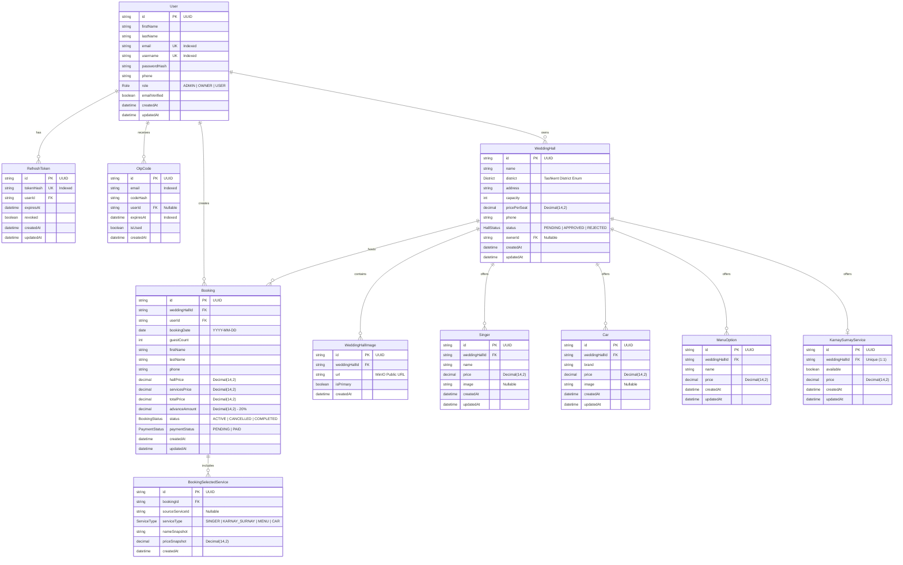

# Database Architecture & Entity Relationships

## 1. Overview & Technology

The ToyxonaHub persistence layer is powered by **PostgreSQL 16** managed through **Prisma ORM (v6.4.1)**. The schema enforces relational integrity, concurrency safeguards, historical price snapshotting, and strict enum typing.

---

## 2. Entity-Relationship (ER) Diagram



---

## 3. Core Database Models

### 1. `User`
- **Purpose**: Central identity model representing customers, venue owners, and platform administrators.
- **Key Fields**: `email` (unique), `username` (unique), `passwordHash` (bcrypt), `role` (`ADMIN`, `OWNER`, `USER`), `emailVerified`.
- **Relations**: Owns multiple `WeddingHall` records (as Owner), creates multiple `Booking` records (as Customer), owns active `RefreshToken` sessions.

### 2. `RefreshToken`
- **Purpose**: Persistent storage for refresh token rotation.
- **Key Fields**: `tokenHash` (SHA-256 unique hash), `expiresAt`, `revoked`.
- **Constraint**: Cascade deletes when the parent `User` is deleted (`onDelete: Cascade`).

### 3. `OtpCode`
- **Purpose**: Database audit record of generated one-time passwords for email verification.
- **Key Fields**: `email`, `codeHash` (SHA-256), `expiresAt`, `isUsed`.

### 4. `WeddingHall`
- **Purpose**: Primary venue profile entity representing a wedding hall in Tashkent.
- **Key Fields**: `name`, `district` (`District` enum of 12 Tashkent districts), `capacity`, `pricePerSeat` (arbitrary-precision `Decimal(14,2)`), `status` (`PENDING`, `APPROVED`, `REJECTED`).
- **Ownership Relation**: References `ownerId` (`User`), sets to null if owner is removed (`onDelete: SetNull`).

### 5. `WeddingHallImage`
- **Purpose**: Gallery images linked to wedding halls stored in MinIO S3.
- **Key Fields**: `url` (public MinIO endpoint URL), `isPrimary` (boolean flag for listing thumbnail).
- **Constraint**: Deletes automatically if the wedding hall is deleted (`onDelete: Cascade`).

### 6. Additional Services (`Singer`, `Car`, `MenuOption`, `KarnaySurnayService`)
- **Purpose**: Optional ceremony services that can be booked alongside a wedding hall.
- **Types**:
  - `Singer`: Live performer / artist with individual pricing.
  - `Car`: Luxury cortege vehicle with individual rental pricing.
  - `MenuOption`: Banquet food/menu option with price per table or package.
  - `KarnaySurnayService`: Single 1-to-1 national ensemble service per wedding hall (`weddingHallId` unique constraint).
- **Cascade**: All services cascade delete with their parent hall.

### 7. `Booking`
- **Purpose**: Authoritative reservation contract between a customer and a wedding hall for a specific date.
- **Key Fields**:
  - `bookingDate`: ISO Date (`@db.Date` without timestamp).
  - `guestCount`: Number of guests (validated $\le \text{hall.capacity}$).
  - `hallPrice`, `servicesPrice`, `totalPrice`: Authoritatively calculated via `Decimal.js`.
  - `advanceAmount`: Exactly 20% of `totalPrice`.
  - `status`: `ACTIVE`, `CANCELLED`, `COMPLETED`.
  - `paymentStatus`: `PENDING`, `PAID`.
- **Constraint**: References `WeddingHall` and `User` with `onDelete: Restrict` to prevent deleting venues or users with historical booking records.

### 8. `BookingSelectedService`
- **Purpose**: Historical price and name snapshot of services chosen during booking creation.
- **Snapshot Immutability**: Stores `nameSnapshot` and `priceSnapshot`. If the venue owner later alters the singer or vehicle prices, the existing booking amount remains historically preserved.

---

## 4. Key Business Constraints & Concurrency Guarantees

### A. Raw Partial Unique Index on Active Bookings
Double-booking prevention is enforced at the database engine level via PostgreSQL raw partial unique index defined in Prisma migration `20260228183000_unique_active_booking_index`:

```sql
CREATE UNIQUE INDEX unique_active_booking_per_hall_date
ON "Booking" ("weddingHallId", "bookingDate")
WHERE status = 'ACTIVE';
```

- **Behavior**: Permits multiple `CANCELLED` or `COMPLETED` records on the same hall/date over time, but allows **strictly at most one** `ACTIVE` booking.
- **Conflict Handling**: Any concurrent race condition triggers database error code `P2002`, mapped immediately by the backend to HTTP `409 Conflict` (`BOOKING_DATE_UNAVAILABLE`).

### B. Tashkent Districts Validation
District classification is locked to PostgreSQL enum `District`:
`BEKTEMIR`, `CHILONZOR`, `YASHNOBOD`, `MIROBOD`, `MIRZO_ULUGBEK`, `SERGELI`, `SHAYXONTOHUR`, `OLMAZOR`, `UCHTEPA`, `YAKKASAROY`, `YUNUSOBOD`, `YANGIHAYOT`.

### C. Decimal Pricing
All monetary values (`pricePerSeat`, `price`, `hallPrice`, `servicesPrice`, `totalPrice`, `advanceAmount`) use PostgreSQL `@db.Decimal(14, 2)` to eliminate floating-point rounding inaccuracies.
